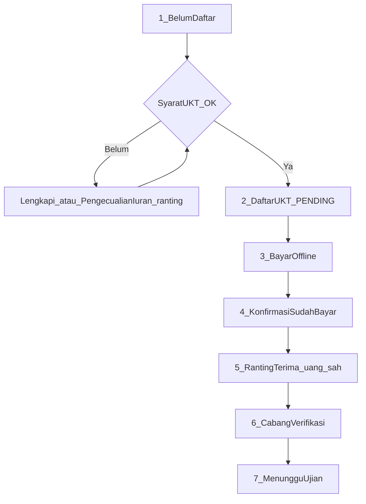

# Proses UKT daftar mandiri (runtut + anti-kebocoran)

## Urutan proses (wajib berurutan)

### 1. Belum daftar (+ lengkapi syarat UKT)
- Badge *Belum terdaftar*; teks *Hubungi ketua ranting…* tetap; tombol **Daftar UKT sekarang**
- **Tanpa nominal biaya** di kartu
- Gate: periode buka, iuran (kecuali **Pengecualian iuran otoritas ranting**), dokumen Akte+BPJS, absensi, anggota aktif
- Gagal → modal checklist + CTA (iuran / minta pengecualian ranting / dokumen / absensi)
- Belum buat pengajuan sampai lolos

### 2. Anggota daftar
- `POST` register — **server** cek eligibility + `memberId` = session saja
- Status **Menunggu Terima Ranting** (`PENDING`)
- **Belum buat billing/tagihan** (cegah bocor nominal lewat iuran)
- Notif ranting: tanpa angka Rp

### 3–4. Bayar offline + konfirmasi
- UI: koordinasi bayar ke ranting, **tanpa Rp**
- **Konfirmasi sudah bayar** = flag saja (`memberPaymentConfirmedAt`); **bukan** lunas, **bukan** buat tagihan
- Status **Menunggu konfirmasi ranting**

### 5. Ranting Terima (uang sah) → teruskan cabang
- **Terima** = satu-satunya titik sistem yang mengakui uang masuk: APPROVED + buat **satu** billing + `WAITING_VERIFICATION`
- Idempotent jika sudah diteruskan
- Scope `dojoId` ranting
- Audit log actor + waktu
- **Tolak** → status kembali Belum Daftar; notif anggota + teks **koordinasi pengembalian** jika sudah konfirmasi bayar; hapus flag konfirmasi

### 6–7. Cabang Verifikasi → Menunggu Ujian
- Label cabang tetap **Verifikasi** (beda dari ranting **Terima**)
- Anggota lihat status + jadwal; **tetap tanpa nominal**

---

## Perbaikan wajib anti-kebocoran (bukan opsional)

### A. Nominal biaya — tutup semua saluran anggota
1. [`IuranListClient`](src/components/member/IuranListClient.tsx): untuk tipe `EVENT` / `UKT` / deskripsi UKT → **jangan tampilkan Rp** (boleh status teks “UKT — dikelola ranting” atau **sembunyikan baris** tagihan UKT dari daftar iuran bulanan).
2. [`dashboard/iuran/page.tsx`](src/app/dashboard/iuran/page.tsx) / `fetchMyBillings`: strip `amount` untuk tagihan UKT sebelum ke client, atau filter keluar dari list iuran rutin.
3. API member (`ukt-status`, register, confirm-payment): **forbidden** field `amount` / `fee` / `billingAmount`.
4. [`notifyUkt*`](src/lib/ukt-notify.ts): template anggota tanpa `Rp` / format rupiah.
5. Kartu Status UKT: tidak ada biaya sabuk / total.

### B. Bypass & integritas
1. Register/confirm: auth session; hanya diri sendiri; eligibility server setiap kali.
2. Confirm-payment hanya jika status masih menunggu ranting; tidak mengubah billing.
3. `@@unique([eventId, memberId])` + catch unique → idempotent.
4. Terima: satu billing aktif per registrasi; ulang Terima = no-op sukses.
5. Ranting Terima/Tolak: anggota harus dalam managed dojo.

### C. Proses uang
1. Konfirmasi anggota **tidak** = lunas.
2. Uang sah di sistem **hanya** setelah ranting **Terima**.
3. Tolak setelah konfirmasi → notif pengembalian (pola Batal UKT).
4. Cabang Verifikasi tetap gerbang akhir sebelum Menunggu Ujian.

### D. Pengecualian iuran
1. Otoritas ranting via `allowEventWithoutDues` (existing).
2. Tidak membuka gate dokumen/absensi.
3. Perubahan pengecualian tetap lewat admin yang sudah ada (audit bila tersedia).

### E. UX label
- Ranting: **Terima** / **Tolak** (pendaftaran + bayar)
- Cabang: **Verifikasi** (pembayaran ke cabang)
- Jangan pakai kata “Verifikasi” di aksi ranting agar tidak tertukar

---

## Ringkas status kartu anggota

| Urutan | Badge | UI |
|--------|-------|-----|
| 1 | Belum terdaftar | Hubungi ranting + **Daftar UKT sekarang** + gate |
| 2 | Menunggu Terima Ranting | Bayar ke ranting (tanpa Rp) |
| 4 | Menunggu konfirmasi ranting | Setelah konfirmasi sudah bayar |
| 5→6 | Menunggu Verifikasi | Ranting sudah Terima & teruskan |
| 7 | Menunggu Ujian | Jadwal + lokasi |

## Jalur ranting daftar langsung
Belum Bayar → Bayar UKT → Verif cabang → Menunggu Ujian. Jika sudah ada pengajuan mandiri → **Terima**, bukan daftar dobel. Tagihan UKT di UI anggota tetap tanpa nominal (aturan A).

## Saat eksekusi (file utama)
- Anti-bocor nominal: `IuranListClient`, iuran page, ukt-notify, member UKT APIs
- `UktStatusCard` + gate modal
- `POST /api/member/ukt/register` + `confirm-payment`
- `UktDashboard` Terima/Tolak + audit
- `ukt-register.ts` / `ukt.ts` + unique schema
- Inventaris §9.3 + §15
